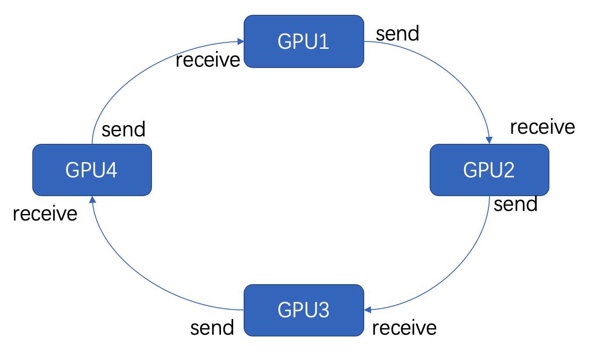
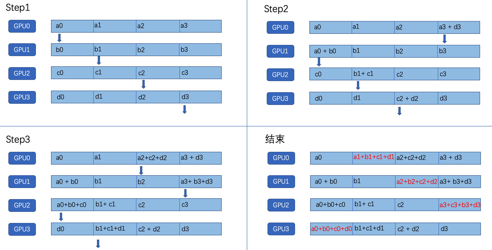
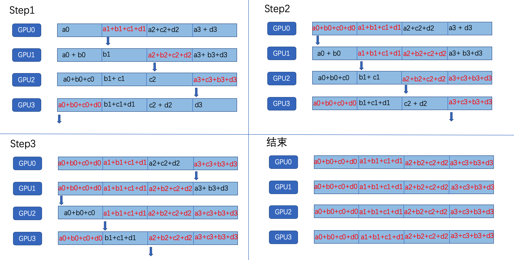
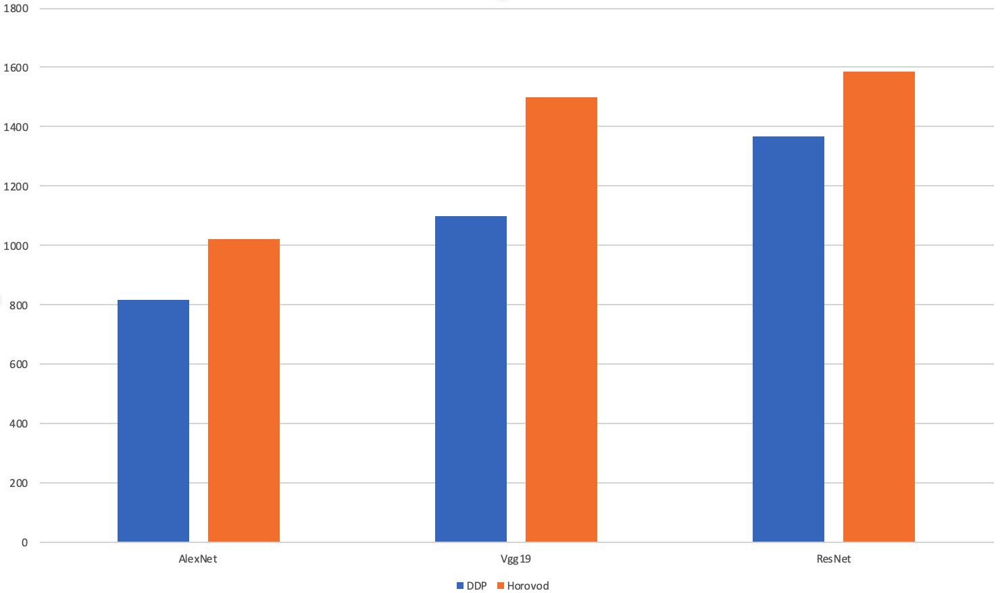

# DDP, Horovod, 单机多卡和多机多卡对比

## ring-allreduce简介

#### 数据并行

数据并行的方法包含在多个节点上并行分割数据和训练。不同批次的数据在不同节点上分别被计算，反向传播得到梯度，然后节点之间通过通信，求得平均梯度，用来对每个节点中的模型副本进行一致化更新。

具体的步骤可以简化为以下几步：

+ 运行训练模型的多个副本，每个副本：
  + 读取数据块
  + 将其输入模型
  + 计算梯度
+ 通过通信，计算所有副本的梯度均值
+ 一致化更新所有模型副本
+ 重复上述步骤


#### ring-allreduce

数据并行这种分布式训练的关键是找到一个好的通信策略。ring-allreduce是一个稳定的通信策略，GPU被组织成了一个逻辑环，每个GPU只有一个左邻和一个右邻；每个GPU只会向它的右邻居发送数据，并从他的左邻居接收数据。



ring-allreduce分为两个步骤，分别是**The Scatter-Reduce**和**The Allgather**。

+ The Scatter-Reduce

  假设有4块GPU，梯度数据将被分为4块，GPU将进行4-1次Scatter-Reduce迭代，每次迭代中，GPU向右邻居发送一个块，并从左邻居接收一个块。第n个GPU从发送块n和接收块n-1开始，每次迭代都发送它在前一次迭代中接收到的块。

  

  

+ The Allgather

  在The scatter-reduce结束后，每个GPU都有一块数据是最终值，接着，GPU交换这些块，以便所有的GPU都具有所需的数据，交换的过程和Scatter-reduce类似

  


之后，每个GPU对梯度求平均，并更新模型，读取下一批数据，进行训练。

## 两种框架的使用

### DDP(单机多卡)

Pytorch的torch.distributed模块中封装了ring-allreduce算法，是官方推荐的分布式训练方法。使用它的具体模式如下：

``` python
import torch.distributed as dist

# Use CUDA
use_cuda = torch.cuda.is_available()
# 当前线程所处的rank
local_rank = dist.get_rank()
# 设定cuda的默认GPU，每个rank不同
torch.cuda.set_device(local_rank) 
# 初始化分布式进程组，backend指定后端通信方式，包括mpi，gloo，nccl。
# init_method是一个url，指定如何初始化进程组(如何找到其他节点)
torch.distributed.init_process_group(backend='nccl',init_method="env://")

def main():
    # 训练集
    trainset = ...
    # 分布式采样器
    sampler = torch.utils.data.distributed.DistributedSampler(trainset)
    # 加载训练集
    trainloader = data.DataLoader(dataset=trainset, batch_size=args.train_batch * dist.get_world_size(), shuffle=False, sampler=sampler)
		# 测试集
    testset = ...
    # 在分布式训练中，一个batch会被划分为几等份，分配给每个GPU进行训练。
    # 因此，batch_size需要乘上GPU的个数
    testloader = data.DataLoader(testset, batch_size=args.test_batch * dist.get_world_size(), shuffle=False, num_workers=args.workers)
    # 准备模型
    model = ...
    # 将模型放在自己的rank对应的cuda上
    # 这里是一个映射关系，cuda[local_rank]会被映射到对应的visible device。
    device = torch.device('cuda', local_rank)
    model = model.to(device)
    # 并行化
    model = torch.nn.parallel.DistributedDataParallel(model, device_ids=[local_rank], output_device=local_rank)    
    # 损失函数和优化方法
    criterion = nn.CrossEntropyLoss()
    optimizer = optim.SGD(model.parameters(), lr=args.lr, momentum=args.momentum, weight_decay=args.weight_decay)
    # Train and val
    for epoch in range(start_epoch, args.epochs):
        train...
				eval...

if __name__ == '__main__':
    main()

```

训练时，需要在指令中分配GPU，确定进程个数等，训练指令可以是：

``` shell
CUDA_VISIBLE_DEVICES=0,1,2,3  python3.5 -m torch.distributed.launch --nproc_per_node=4 cifar.py [other arguments]
```

### horovod

horovod是Uber开源的使用ring-allreduce算法分布式训练框架，适用于多个机器学习框架。

Pytorch中使用horovod的模式如下：

``` python
import horovod.torch as hvd
# 初始化
hvd.init()
# 分配rank
local_rank = hvd.local_rank()
torch.cuda.set_device(local_rank)

def main():
    # 训练集
    trainset = ...
    # 分布式采样器
    sampler = torch.utils.data.distributed.DistributedSampler(trainset,num_replicas=hvd.size(), rank=hvd.rank())
    # 加载训练集
    trainloader = data.DataLoader(dataset=trainset, batch_size=args.train_batch, shuffle=False, sampler=sampler)
		# 测试集
    testset = ...
    testloader = data.DataLoader(testset, batch_size=args.test_batch * hvd.size(), shuffle=False, num_workers=args.workers)
    # 准备模型
		model=...
    # 将模型放到指定cuda
    device = torch.device('cuda', local_rank)
    model = model.to(device)
    # 损失函数和优化器
    criterion = nn.CrossEntropyLoss()
    optimizer = optim.SGD(model.parameters(), lr=args.lr, momentum=args.momentum, weight_decay=args.weight_decay)
    # 用horovod封装优化器
    optimizer = hvd.DistributedOptimizer(optimizer, named_parameters=model.named_parameters())
    # 广播参数，这个是为了在一开始的时候同步各个gpu之间的参数
    hvd.broadcast_parameters(model.state_dict(), root_rank=0)
    # Train and val
    for epoch in range(start_epoch, args.epochs):
        train...
        eval...
        
if __name__ == '__main__':
    main()

```


训练时也需要在指令中分配GPU，确定进程个数

``` shell
CUDA_VISIBLE_DEVICES=0,1,2,3 horovodrun -np 4 -H localhost:4 python3.5 cifar_horovod.py [other arguments]
```


### DDP 多机多卡

在多机多卡中，由于涉及到多个主机之间的通信，所以在<code>dist.init_progress_group()</code>的init_method参数中，需要指定多个进程如何进行通信。init_method有两种初始化方法:

+ 使用TCP初始化：

  ``` python
  torch.distributed.init_process_group(backend='nccl',
                                       init_method="tcp://210.28.134.32:29998",
                                       rank=local_rank, 
                                       world_size=world_size)
  ```

+ 使用共享文件系统初始化

  ``` python
  torch.distributed.init_process_group(backend='nccl',
                                       init_method="file:///data/share/sharedfile",
                                       rank=local_rank, 
                                       world_size=world_size)
  ```

  注意，不管是哪种初始化方法，都需要提供rank和world_size。在TCP初始化中，rank为0的节点作为主节点，init_method中的IP地址对应主节点的IP地址。world_size指定一共需要的进程个数，在启动的进程数目达到world_size之前，<code>init_prpcess_group</code>将会阻塞。

代码模式：

``` python
import torch
import torch.distributed as dist

def my_init():
    # GPU allocation
    global local_rank
    global gpu_id
    # 在使用torch.distributed.launch启动时，gpu_id就是rank
    # 但是在多节点情况下，需要手动设置
    world_size = args.wz
    gpu_id = args.gpu_id
    local_rank = args.local_rank
    torch.cuda.set_device(gpu_id) # 设定cuda的默认GPU，每个rank不同
    torch.distributed.init_process_group(backend='nccl',init_method="tcp://210.28.134.32:29998" ,rank=local_rank, world_size=world_size)

def main():
    trainset = ...
    sampler = torch.utils.data.distributed.DistributedSampler(trainset)
    trainloader = data.DataLoader(dataset=trainset, batch_size=args.train_batch * dist.get_world_size(), shuffle=False, sampler=sampler)
    testset = ...
    testloader = data.DataLoader(testset, batch_size=args.test_batch * dist.get_world_size(), shuffle=False, num_workers=args.workers)

    # Model
    
		model = ...
    device = torch.device('cuda', gpu_id)
    model = model.to(device)
    model = torch.nn.parallel.DistributedDataParallel(model, device_ids=[gpu_id], output_device=gpu_id)    
    criterion = nn.CrossEntropyLoss()
    optimizer = optim.SGD(model.parameters(), lr=args.lr, momentum=args.momentum, weight_decay=args.weight_decay)


    # Train and val
    for epoch in range(start_epoch, args.epochs):
        train...
        eval...

if __name__ == '__main__':
    my_init()
    main()

```

训练启动：

使用DDP进行多机多卡分布式训练的启动过程比较繁琐，需要手动逐个启动每个进程。

``` shell
#host1
python cifar_multi_nodes.py --local-rank 0 --world-size 4 --gpu-id 2 [other args]
python cifar_multi_nodes.py --local-rank 1 --world-size 4 --gpu-id 3 [other args]
#host2
python cifar_multi_nodes.py --local-rank 2 --world-size 4 --gpu-id 7 [other args]
python cifar_multi_nodes.py --local-rank 3 --world-size 4 --gpu-id 8 [other args]
```


### Horovod 多机多卡

horovod多机多卡不需要对代码进行任何修改，只需要运行至指定多个host和每个host的进程数目即可

``` shell
CUDA_VISIBLE_DEVICES=0,1 horovodrun -np 4 -H host1:2,host2:2 python cifar_horovod.py [other args]
```


## 效果对比



经过测试发现，多台机器之间训练的速度非常慢，对于参数较多的模型，速度比单机还要慢，可能是受限于网络的传输速度。